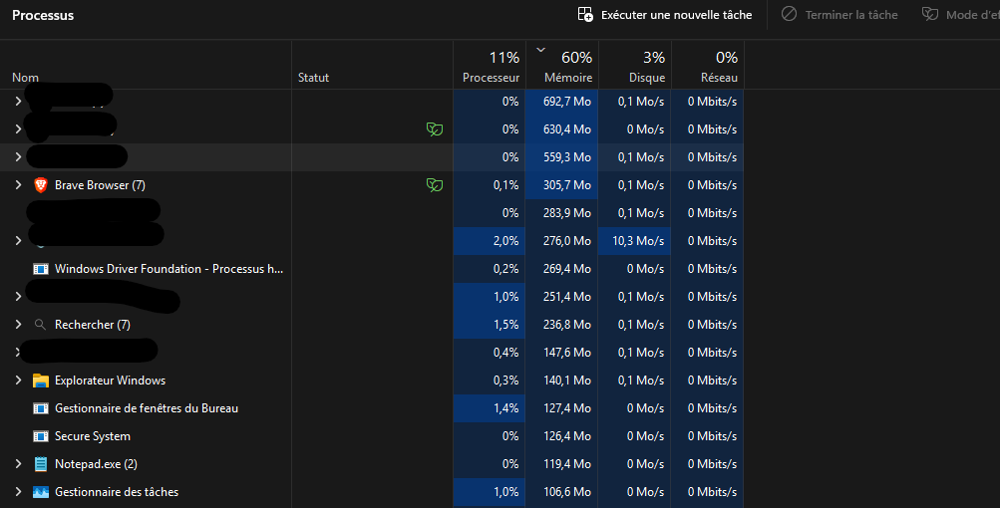

# Brave Free Origin (v1.4)

`Brave Free Origin` is a Windows GUI tool that turns normal Brave into a leaner, stripped-down build without paying for Brave Origin.

The point is simple: Brave took the "remove the AI, crypto, VPN, promo junk" idea, called it Origin, and put it behind a paid upgrade. This project does the local Windows policy version of that idea for free, and then goes further with extra performance-focused modes.

It is inspired by [MulesGaming/brave-debullshitinator](https://github.com/MulesGaming/brave-debullshitinator), but reshaped into a cleaner WinForms app with one-click modes, screenshots, backups, and a more normal Windows-user flow.

## What It Does

The app writes Brave enterprise policies to:

`HKLM\Software\Policies\BraveSoftware\Brave`

That means it is not just hiding buttons visually. It is using the same managed-policy system organizations use to disable features in Chromium-based browsers.

It can disable or reduce:

- Leo / AI and Chromium GenAI features
- Brave Rewards
- Brave Wallet / crypto / Web3 extras
- Brave VPN
- Brave News
- Brave Talk
- Playlist / Speedreader / Tor / IPFS / WebTorrent
- P3A analytics, stats pings, Web Discovery, UMA metrics
- background mode, prediction, media router, misc telemetry
- first-run import nags, promo tabs, and other clutter
- Brave update tasks and services in the aggressive modes

It can also tune Brave for a lighter footprint:

- QUIC / HTTP3 on
- hardware acceleration on
- memory saver on
- lighter startup behavior
- blank homepage / blank new tab in the performance modes
- disk cache cap
- less background browser noise

## Modes

| Mode | What it is for |
|------|----------------|
| **Quick Debloat** | Light cleanup. Removes the loudest commercial extras without changing too much. |
| **Recommended** | Good default. Debloat + privacy + compatibility-friendly settings. |
| **Origin Mode** | The free local answer to Brave Origin. Focused on disabling non-core extras. |
| **Privacy + Boost** | Origin-style cleanup plus startup and responsiveness tuning. |
| **Max Performance** | Most aggressive speed/footprint profile. Cuts more features and also disables Brave updater tasks/services. |
| **Max Privacy** | Hard privacy lockdown. Strongest privacy stance, but it can break updates and convenience features. |
| **Stock / None** | Clears selections so you can remove enforced policies and go back toward stock behavior. |

## Before / After

These screenshots are included in the project folder and show the exact comparison you added.

In your example, `Brave Browser (7)` drops from about **305.7 MB** to **222.4 MB** in Task Manager after optimization.

### Before



### After


## Windows Quick Start

1. Extract the whole folder somewhere normal first.
2. Do not run it from inside a ZIP.
3. Double-click `Brave-Free-Origin.bat`.
4. Accept the UAC prompt when Windows asks for administrator rights.
5. In the app, click `Load current state` if you want to inspect what is already active.
6. Pick a mode.
7. Click `Apply to Brave`.
8. Fully restart Brave.
9. Open `brave://policy` and verify the policies show `Platform / Machine / OK`.

## Important Windows Notes

### Administrator rights

This app writes under `HKLM`, so admin rights are required. That is normal. The PowerShell script auto-elevates, and the BAT launcher warns you about the UAC prompt.

### Execution policy

You do **not** need to change your system PowerShell execution policy.

The launcher already starts PowerShell like this:

```powershell
powershell.exe -NoLogo -NoProfile -ExecutionPolicy Bypass -File ".\Brave-Free-Origin.ps1"
```

That bypass applies only to that launch of the script. It does not permanently weaken your machine's policy.

### SmartScreen / "Windows protected your PC"

If Windows shows SmartScreen because this is a local script you made or downloaded:

1. Click `More info`
2. Click `Run anyway`

Only do that if you trust this copy and know where it came from.

### "This file came from another computer"

If you downloaded the project and Windows blocks it:

1. Right-click `Brave-Free-Origin.bat` or `Brave-Free-Origin.ps1`
2. Click `Properties`
3. If you see `Unblock`, tick it
4. Click `Apply`

If needed, do the same for the whole extracted folder contents.

### Defender / antivirus warning

Registry-editing tools, batch files, and PowerShell launchers can look suspicious to Windows security tools even when they are harmless. That is expected behavior for a tweak utility. Read the script if you want to verify exactly what it does.

## Manual Launch

If the BAT file is not working for some reason, open PowerShell in the project folder and run:

```powershell
powershell.exe -NoLogo -NoProfile -ExecutionPolicy Bypass -File ".\Brave-Free-Origin.ps1"
```

If PowerShell says access is denied, the usual causes are:

- the folder is still inside a ZIP
- the file is blocked by Windows
- you refused the UAC elevation prompt
- another program is locking the file in OneDrive

## How To Verify It Worked

After applying settings and restarting Brave:

1. Open `brave://policy`
2. Look for the policies you selected
3. Check that each relevant policy shows:

- `Source: Platform`
- `Scope: Machine`
- `Status: OK`

Then do a real-world check:

- Leo should be gone or disabled
- Rewards / Wallet / VPN / News UI should be reduced or removed depending on mode
- startup should feel lighter in the performance modes
- update services/tasks should only be disabled in the aggressive modes

## Restore / Undo

The app can export backups before applying changes.

Backups go to:

`%USERPROFILE%\Documents\Brave-Free-Origin-Backups\`

To undo:

1. Re-run the app
2. Use `Stock / None` and click `Apply to Brave`

Or:

1. Use `Remove ALL policies`

Or:

1. Double-click a `.reg` backup file to restore a previous registry state

## Caveats

- `Origin Mode` is meant to mimic the stripped-down Brave Origin idea, but it is still doing it through Windows policies, not through a custom Brave build.
- `Max Performance` is aggressive on purpose. It disables more convenience features and Brave updater services/tasks to cut overhead further.
- `Max Privacy` is even harsher in some areas and can affect sign-in, sync, imports, component updates, and update flow.
- Turning off component updates can break Widevine/DRM playback such as Netflix or some Spotify web playback scenarios.
- Some Brave-side UI bugs can leave elements visible even when the policy is correctly applied. In that case, trust `brave://policy` first.

## File Layout

```text
BraveDebullshitinator-Pro/
├── Brave-Free-Origin.ps1
├── Brave-Free-Origin.bat
├── Brave-before.png
├── Brave-after.png
├── README.md
├── Brave-before.png
└── Brave-after.png
```

## Sources

- [Brave Help Center - Group Policy](https://support.brave.com/hc/en-us/articles/360039248271-Group-Policy)
- [Brave Help Center - What is Brave Origin?](https://support.brave.app/hc/en-us/articles/38561489788173-What-is-Brave-Origin)
- [brave-core policy definitions](https://github.com/brave/brave-core/tree/master/components/policy/resources/templates/policy_definitions/BraveSoftware)
- [Chrome Enterprise Policy List](https://chromeenterprise.google/policies/)
- Original [MulesGaming/brave-debullshitinator](https://github.com/MulesGaming/brave-debullshitinator)
