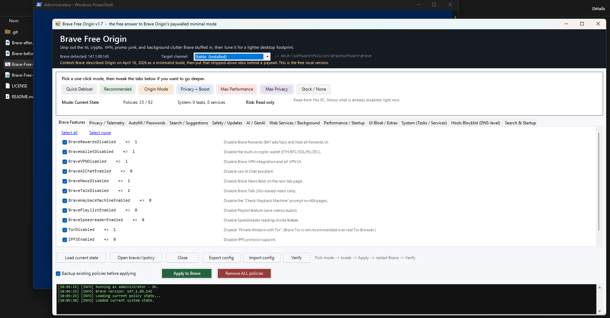
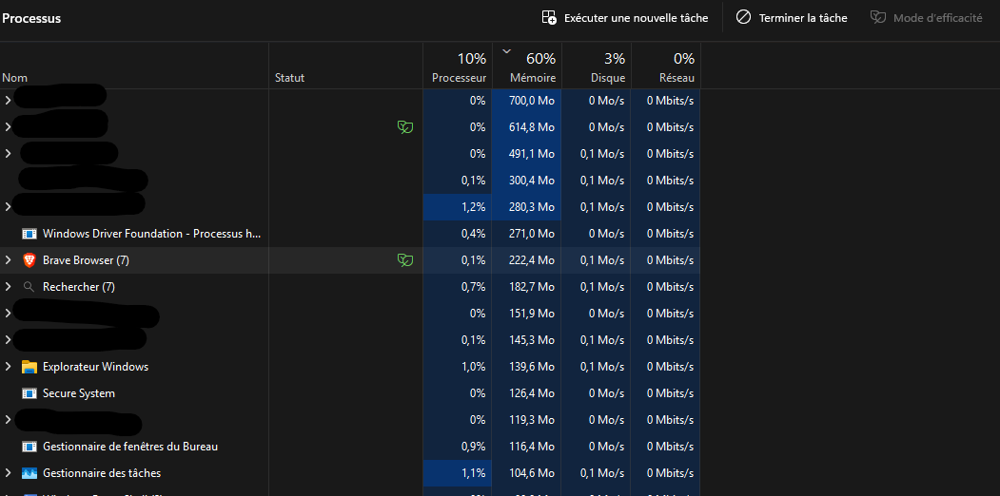

# Brave Free Origin (v1.11)

`Brave Free Origin` is a Windows GUI tool that turns normal Brave into a leaner, stripped-down build without paying for Brave Origin.

The point is simple: Brave took the "remove the AI, crypto, VPN, promo junk" idea, called it Origin, and put it behind a paid upgrade. This project does the local Windows policy version of that idea for free, and then goes further with extra performance-focused modes.

It is inspired by [MulesGaming/brave-debullshitinator](https://github.com/MulesGaming/brave-debullshitinator), but reshaped into a cleaner WinForms app with one-click modes, screenshots, backups, and a more normal Windows-user flow.



---

## Quick Start (read this first)

**1. Extract the whole folder out of the ZIP.** Don't try to run anything from inside the ZIP — Windows blocks PowerShell scripts launched from compressed archives.

**2. Double-click `Brave-Free-Origin.bat`.**

That is the launcher. It opens PowerShell with the right execution-policy flag and asks Windows for administrator permission.

> ⚠️ **Important:** do **not** double-click `Brave-Free-Origin.ps1` directly. Windows opens `.ps1` files in Notepad by default — the GUI will *not* appear and you will think the tool is broken. **Always use the `.bat`.**

**3. Click "Yes" on the UAC prompt.** Admin rights are required because the tool writes to `HKEY_LOCAL_MACHINE\Software\Policies\BraveSoftware\Brave` — the same place corporate IT writes group policies. No admin = no policies = nothing happens.

**4. In the GUI, click `Load current state`** (top-left) if you want to see what's already configured on your machine. The boxes light up to show what is already enforced.

**5. Pick a mode** in the colored button row at the top:

| Button | What it does |
|---|---|
| **Quick Debloat** | Lightest cleanup. Removes the loudest extras (Rewards, Wallet, VPN, AI, password manager). Safest. |
| **Recommended** | Sensible daily-driver setup. Good privacy + lighter UI + media-friendly defaults. |
| **Origin Mode** | The free local answer to Brave's paywalled "Origin" build. |
| **Privacy + Boost** | Origin Mode + startup and latency tuning. The performance default. |
| **Max Performance** | Origin + Boost + Max Privacy unioned + extra UI trims. Aggressive. |
| **Max Privacy** | Hard lockdown — disables sync, sign-in, imports, Brave update services. |
| **Stock / None** | Unticks everything. Click `Apply to Brave` after to revert to default Brave. |

**6. (Optional) Tweak the tabs** below the buttons if you want to add/remove individual policies.

There is also a `Default Scriptlets (Advanced)` tab. That is a separate optional tool for viewing Brave's built-in adblock scriptlet rules and manually disabling selected ones. Presets and the big `Apply to Brave` button never touch it.

**7. Click `Preview changes`** before applying. It shows exactly what will be added, changed, cleared, disabled, or reset. Nothing is written from Preview.

**8. Click `Apply to Brave`** (the big green button). Then **fully close and reopen Brave** — running tabs need a restart to pick up the new policies.

**9. (Recommended)** Click the `Verify` button in the app. It reads the registry back and confirms your selections actually landed. You can copy or save the report. Or open `brave://policy` and check that each policy shows `Source: Platform`, `Scope: Machine`, `Status: OK`.

### Files in this folder

```
Brave-Free-Origin/
├── Brave-Free-Origin.bat   ← double-click THIS one
├── Brave-Free-Origin.ps1   ← never double-click this (opens in Notepad)
├── README.md               ← you are here
├── LICENSE
└── images/
    ├── screenshot.png      ← GUI preview shown above
    ├── Brave-before.png    ← memory comparison: before
    └── Brave-after.png     ← memory comparison: after
```

The launcher (`.bat`) is essentially one line: it runs the PowerShell script with `-ExecutionPolicy Bypass`. That bypass is scoped only to that single launch — it does **not** weaken your machine's PowerShell policy.

---

<details>
<summary><strong>📜 Changelog (click to expand)</strong></summary>

### What's new in v1.11

This fixes the scriptlet scan hang from v1.10.

- **Chunked in-app scanner.** Replaces the background-job scan with a timer-based chunk scanner, avoiding the slow PowerShell job serialization step that could sit on `Loading scriptlet scan results...` for minutes.
- **Real progress bar.** The Scriptlets tab now shows a blue progress bar and live status based on files/bytes processed, current file, elapsed seconds, and rules found.
- **Responsive during scan.** The scan yields back to the GUI every small chunk, so Windows should not mark the app as Not Responding while large Brave lists are being read.
- **Chunked table rendering.** Large scriptlet result sets render in batches instead of locking the whole window while thousands of rows are painted.
- **Safer bulk checking.** `Check filtered` now checks every scanned rule matching the current search/filter, including rows that are not currently painted in the table yet.
- **Clearer filtered workflow.** If `Show disabled by this app only` is enabled, `Check filtered` only checks the disabled subset currently being shown. Untick it and clear the search box before bulk-disabling every scriptlet rule.

### What's new in v1.10

This is the scriptlet-manager usability fix.

- **Background scriptlet scan.** Loading Brave's internal scriptlet lists now runs in a background PowerShell job instead of freezing the whole GUI.
- **Faster table refresh.** Search/filter updates use debouncing and bulk row loading, so toggling filters no longer feels like the app died.
- **Checkbox selection.** Scriptlet rows now have checkboxes. Checked rows are used first; normal highlighted selection still works as a fallback.
- **Check filtered / clear checks.** Search for something like `youtube`, click `Check filtered`, then disable or enable the filtered set in one action.
- **Clearer wording.** The UI says `disabled by this app` / `Disabled by Brave Free Origin` instead of assuming everyone knows what `BFO` means. The internal file marker remains `! BFO disabled:` for compatibility with existing backups and disabled rules.
- **Adaptive columns.** The scriptlet table now resizes its columns with the window instead of staying stuck at the original widths.

### What's new in v1.9

This is the advanced scriptlet transparency release. It adds a separate manager for Brave's built-in adblock scriptlets without mixing that risky workflow into the normal presets.

- **Default Scriptlets (Advanced) tab.** Scans Brave `User Data` component folders for filter-list `list.txt` files and lists internal `##+js(...)` scriptlet rules.
- **Viewer columns for auditability.** Shows enabled state, domain, scriptlet name, arguments, source/version, line number, and raw rule.
- **Portable path handling.** Auto-detects Brave Stable/Beta/Nightly/Dev User Data locations from `%LOCALAPPDATA%`, with manual `Browse...` support when Brave lives somewhere unusual.
- **Manual-only advanced editing.** Scriptlet edits are not part of Quick Debloat, Recommended, Origin Mode, Max Performance, Max Privacy, presets, config apply, or the main `Apply to Brave` button. You must open the advanced tab, scan, tick `Advanced edit mode`, select rules, and confirm the action.
- **Per-scriptlet disable/enable.** Disabling comments rules with `! BFO disabled:`. Enabling restores the original rule text.
- **Duplicate handling.** Brave lists can contain the same raw scriptlet rule more than once; the manager can affect duplicate raw rules in the same file so one selection does not leave a twin active by accident.
- **Backup and restore.** Creates `list.txt.bfo-backup` before edits, with buttons to back up all loaded lists, restore the selected file, or restore all scriptlet backups under the selected User Data folder.
- **Export and reapply preferences.** Exports currently disabled raw rules to JSON and can reapply those disabled preferences after Brave updates replace component versions.
- **CSV export.** Saves the visible filtered scriptlet table for inspection, bug reports, or GitHub issue evidence.

### What's new in v1.8

This is the trust-and-restore release. No random checkbox pile-on; the point is making the tool safer to use and easier to audit.

- **Preview changes button.** Generates a dry-run report before writing anything. It shows per-channel policy adds, changes, clears, already-correct values, search/new-tab/startup override changes, scheduled task actions, service actions, and a reminder that hosts are managed separately.
- **Preview hosts button.** The Hosts tab now shows what domains will be added, kept, or removed from the Brave-Free-Origin sentinel block before editing `hosts`.
- **Full restore / stock button.** Replaces the old narrow "Remove ALL policies" behavior. It now removes Brave policy keys, clears the Brave-Free-Origin hosts block, re-enables known Brave update scheduled tasks, and resets known disabled Brave services to Manual.
- **Copy/save reports.** Preview and Verify reports open in a scrollable dialog with Copy and Save report buttons. This makes support/debugging cleaner.
- **Config export version bumped to `1.8`.** Exported JSON now reflects the current app generation.

### What's new in v1.7

Two fixes / additions, both about the ad blocker.

- **Preset bug fix: Origin Mode and Privacy + Boost now enforce ad blocking.** Earlier versions used a hand-curated list that omitted the Shields policies, so picking those modes left ad blocking at Brave's default instead of `Block`. Ad blocking is a **performance win** (fewer requests, less DOM, less JS) on top of being Brave's whole identity, so it belongs in the boost preset. Origin Mode and everything that derives from it now also force `DefaultBraveAdblockSetting=Block`, fingerprint protection to Standard, strict referrers, tracking-param stripping, De-AMP, and debouncing.
- **Extensions section in the Search & Startup tab.** Two convenience buttons that just open install pages in Brave — no force-install, no "Managed by your organization" banner. uBlock Origin Lite (MV3-safe), Brave Shields settings, Bitwarden. Includes a one-line warning about double-blocking if you stack uBO on top of Shields.

#### Why we don't auto-install uBlock Origin

Brave Shields and uBO are roughly equivalent — same filter-list lineage, Shields runs native in the engine so it's marginally faster than uBO-as-an-extension. Stacking both wastes CPU per tab and breaks sites Shields handles fine because their default filter sets differ. Force-installing extensions via `ExtensionInstallForcelist` shows users a "Managed by your organization" banner and locks the extension on, which is invasive UX. Manifest V2 is also being deprecated, so pinning users to full uBO would age badly. uBO Lite (MV3) is the future-proof choice if you want a second blocker, hence the button.

### What's new in v1.6

Two additions, both opt-in.

- **Search & Startup tab.** Three independent sections, each gated by its own checkbox so nothing fires unless you explicitly tick it.
  - **Default search engine** for the omnibox: Brave Search, DuckDuckGo, Startpage, Qwant, Ecosia, Mojeek, Kagi, Google, Bing, Yandex, or a custom URL (must contain `{searchTerms}`). Writes the `DefaultSearchProvider*` policies. Untick + Apply removes the override and lets Brave's user-chosen engine come back.
  - **New tab page**: blank / search engine homepage / custom URL. Writes `NewTabPageLocation`. Replaces and overrides anything the Performance tab set.
  - **Startup behavior**: open new tab / restore last session / open blank / open a specific page or comma-separated set. Writes `RestoreOnStartup` and (when applicable) the `RestoreOnStartupURLs` list policy.
  - All three run **last** in the apply order, so they cleanly win over any matching policy ticks in the Performance / Startup tab. They also clear their own keys before writing, so unticking + Apply truly removes the override (no orphan registry entries).
  - Round-trips through Export/Import config and is included in the Verify report.

- **Hosts blocks now wire into presets, with a strict no-orphan rule.** Picking a mode now also pre-ticks the hosts groups whose underlying feature is *also* being disabled by that mode's policies. Specifically:
  - Quick Debloat → P3A, Variations, Stats ping, Web Discovery, Rewards (matches its policy set; News stays unblocked because Quick leaves News policy on).
  - Recommended / Origin / Privacy + Boost → above + News CDN.
  - Max Performance / Max Privacy → above + Component Updates (matches `ComponentUpdatesEnabled = 0`).
  - Stock / None → all unticked.
  - Hosts apply still has its own button in the Hosts tab — presets only suggest, they never write hosts entries silently.

### What's new in v1.5

Four additions, all opt-in and reversible. Nothing changes in existing modes — the new features sit alongside what you already know.

- **Multi-channel target selector.** A dropdown in the header now lets you point the apply at Brave Stable, Beta, Nightly, Dev, or all installed channels at once. Other channels share the same policy schema but live under separate registry hives.
- **Hosts file blocklist tab.** Optional DNS-level kill switch for Brave telemetry domains. Even if a Brave update bypasses a policy, the network call still fails. Sentinel-tagged in the hosts file (`# === Brave-Free-Origin START ===` / `=== END ===`) so removal is surgical and never touches your other entries. Auto-backs up `hosts` before any write. Has its own Apply / Remove buttons inside the tab — does **not** fire from the main "Apply to Brave" button, so you can never edit hosts by accident.
- **Export / Import config.** Save your tuned checkbox state to a JSON file and reuse it on another machine, or share a community preset. Round-trips policies, tasks, services, and hosts groups.
- **Verify button.** Reads the registry of every target channel and reports back which selected policies are present, missing, or have a wrong value. Also lists currently-blocked hosts entries. Useful when [Brave bug 45106](https://github.com/brave/brave-browser/issues/45106) leaves a feature visible despite the policy being set — `Verify` proves the registry is correct so you know whose problem it is.

#### Will antivirus flag any of this?

Short answer: no, by design.

- No executable modification, no code-signing changes, no hex-edited binaries.
- No new scheduled tasks, no auto-startup entries, no persistence mechanism.
- Registry writes target the standard enterprise-policy hive — exactly what corporate IT does to manage browsers.
- Hosts file edits use a clearly-labeled sentinel block that an admin can read or remove with Notepad. We use ASCII encoding (the format Windows expects); some AVs flag UTF-16 hosts files, ours does not.
- Every destructive operation backs up first, into `Documents\Brave-Free-Origin-Backups\`.

If your AV does flag the script, it's flagging the act of registry writes from PowerShell, not anything specific we do. Reading the script confirms it.

#### Conflict notes

The new features don't conflict with each other or with the existing modes. A few things to know:

- Hosts blocking is a layered defense **on top of** policies, not a replacement. Picking a mode + ticking hosts blocks is the intended use.
- The **Components** hosts group will stop Widevine and similar from updating. Only tick it if you also have `ComponentUpdatesEnabled` policy off (the same caveat as in Max Privacy mode).
- Multi-channel apply does the same set of policies to every selected channel. If you only have Stable installed, leave the dropdown on Stable.
- `Verify` reads from the dropdown's selected channel(s). Switch the dropdown, click Verify again to check a different channel.

</details>

---

## What It Does

The app writes Brave enterprise policies to:

`HKLM\Software\Policies\BraveSoftware\Brave`

That means it is not just hiding buttons visually. It is using the same managed-policy system organizations use to disable features in Chromium-based browsers.

It can disable or reduce:

- Leo / AI and Chromium GenAI features
- Brave Rewards
- Brave Wallet / crypto / Web3 extras
- Brave VPN
- Brave News
- Brave Talk
- Playlist / Speedreader / Tor / IPFS / WebTorrent
- P3A analytics, stats pings, Web Discovery, UMA metrics
- background mode, prediction, media router, misc telemetry
- first-run import nags, promo tabs, and other clutter
- Brave update tasks and services in the aggressive modes

It can also tune Brave for a lighter footprint:

- QUIC / HTTP3 on
- hardware acceleration on
- memory saver on
- lighter startup behavior
- blank homepage / blank new tab in the performance modes
- disk cache cap
- less background browser noise

v1.9 also adds an optional advanced scriptlet manager. It can view and manually disable Brave's built-in adblock scriptlet rules in component filter lists. This is intentionally separate from the normal policy system and is only for users who choose to open the advanced tab and accept the warnings.

### Advanced scriptlet manager notes

The `Default Scriptlets (Advanced)` tab is not part of the normal preset/apply flow. The one-click modes, policy tabs, config import, and big `Apply to Brave` button do not edit Brave's internal filter-list files.

To bulk-disable matching scriptlets:

1. Open `Default Scriptlets (Advanced)`.
2. Click `Scan` and wait for rendering to finish.
3. Use `Search/filter` if you only want a subset, such as `youtube`.
4. Leave `Show disabled by this app only` unticked if you want active rules included.
5. Tick `Advanced edit mode`.
6. Click `Check filtered`.
7. Confirm the status line shows the expected `Checked:` count.
8. Click `Disable checked`.

Disabling scriptlets is not the same as disabling Brave adblocking. Scriptlets are only the `##+js(...)` injected-rule layer used for site fixes, anti-annoyance behavior, cookie banners, video workarounds, and some anti-adblock handling. Brave can still block ads through network filters, cosmetic filters, and Shields even when scriptlets are disabled.

## Before / After

These screenshots are included in the project folder and show the exact comparison you added.

In your example, `Brave Browser (7)` drops from about **305.7 MB** to **222.4 MB** in Task Manager after optimization.

### Before


### After



## Important Windows Notes

### Administrator rights

This app writes under `HKLM`, so admin rights are required. That is normal. The PowerShell script auto-elevates, and the BAT launcher warns you about the UAC prompt.

### Execution policy

You do **not** need to change your system PowerShell execution policy.

The launcher already starts PowerShell like this:

```powershell
powershell.exe -NoLogo -NoProfile -ExecutionPolicy Bypass -File ".\Brave-Free-Origin.ps1"
```

That bypass applies only to that launch of the script. It does not permanently weaken your machine's policy.

### SmartScreen / "Windows protected your PC"

If Windows shows SmartScreen because this is a local script you made or downloaded:

1. Click `More info`
2. Click `Run anyway`

Only do that if you trust this copy and know where it came from.

### "This file came from another computer"

If you downloaded the project and Windows blocks it:

1. Right-click `Brave-Free-Origin.bat` or `Brave-Free-Origin.ps1`
2. Click `Properties`
3. If you see `Unblock`, tick it
4. Click `Apply`

If needed, do the same for the whole extracted folder contents.

### Defender / antivirus warning

Registry-editing tools, batch files, and PowerShell launchers can look suspicious to Windows security tools even when they are harmless. That is expected behavior for a tweak utility. Read the script if you want to verify exactly what it does.

## Manual Launch

If the BAT file is not working for some reason, open PowerShell in the project folder and run:

```powershell
powershell.exe -NoLogo -NoProfile -ExecutionPolicy Bypass -File ".\Brave-Free-Origin.ps1"
```

If PowerShell says access is denied, the usual causes are:

- the folder is still inside a ZIP
- the file is blocked by Windows
- you refused the UAC elevation prompt
- another program is locking the file in OneDrive

## How To Verify It Worked

After applying settings and restarting Brave:

1. Open `brave://policy`
2. Look for the policies you selected
3. Check that each relevant policy shows:

- `Source: Platform`
- `Scope: Machine`
- `Status: OK`

Then do a real-world check:

- Leo should be gone or disabled
- Rewards / Wallet / VPN / News UI should be reduced or removed depending on mode
- startup should feel lighter in the performance modes
- update services/tasks should only be disabled in the aggressive modes

The in-app `Verify` report can be copied or saved to a text file. That is useful if Brave's UI still looks wrong but `brave://policy` says the registry policy is applied correctly.

## Restore / Undo

The app can export backups before applying changes, and v1.8 added a stronger stock restore path. v1.9 adds a separate backup/restore path for advanced scriptlet edits.

Backups go to:

`%USERPROFILE%\Documents\Brave-Free-Origin-Backups\`

To preview a change before committing it:

1. Pick a mode or tweak checkboxes
2. Click `Preview changes`
3. Review the report
4. Click `Apply to Brave` only if it looks right

To fully restore stock behavior:

1. Re-run the app
2. Select the target channel, or `All installed channels`
3. Click `Full restore / stock`

That removes Brave policy keys, clears the Brave-Free-Origin hosts block, re-enables known Brave update tasks, and resets known disabled Brave services to Manual.

For a lighter policy-only revert:

1. Use `Stock / None`
2. Click `Preview changes`
3. Click `Apply to Brave`

Or:

1. Double-click a `.reg` backup file to restore a previous registry state

Or:

1. Use the Hosts tab's `Remove hosts block` button to clear only the DNS-level blocklist

Or, for advanced scriptlet edits only:

1. Open `Default Scriptlets (Advanced)`
2. Scan your Brave `User Data` folder
3. Tick `Advanced edit mode`
4. Use `Restore selected file` or `Restore all backups`

Scriptlet restores use the local `list.txt.bfo-backup` files created beside Brave's component filter lists.

## Caveats

- `Origin Mode` is meant to mimic the stripped-down Brave Origin idea, but it is still doing it through Windows policies, not through a custom Brave build.
- `Max Performance` is aggressive on purpose. It disables more convenience features and Brave updater services/tasks to cut overhead further.
- `Max Privacy` is even harsher in some areas and can affect sign-in, sync, imports, component updates, and update flow.
- Turning off component updates can break Widevine/DRM playback such as Netflix or some Spotify web playback scenarios.
- Disabling built-in Brave scriptlets can break adblocking, anti-annoyance fixes, cookie banners, video playback, or site compatibility. Use the scriptlet manager only when you know which rule you are changing.
- Brave can replace component filter-list versions during updates. Export disabled scriptlet preferences if you want to reapply the same raw-rule disables after an update.
- Some Brave-side UI bugs can leave elements visible even when the policy is correctly applied. In that case, trust `brave://policy` first.

## File Layout

```text
Brave-Free-Origin/
├── Brave-Free-Origin.bat     # UAC-elevating launcher  ← double-click THIS
├── Brave-Free-Origin.ps1     # Main GUI, single-file WinForms app
├── README.md                 # this file
├── LICENSE
└── images/
    ├── screenshot.png        # GUI preview
    ├── Brave-before.png      # Memory comparison: before
    └── Brave-after.png       # Memory comparison: after
```

Backups land here:

```text
%USERPROFILE%\Documents\Brave-Free-Origin-Backups\
├── brave-policies-backup-YYYYMMDD-HHMMSS.reg   # registry snapshot before each apply
├── hosts-backup-YYYYMMDD-HHMMSS.bak            # hosts snapshot before each hosts apply
└── brave-free-origin-config-YYYYMMDD-HHMMSS.json   # exported configs
```

Advanced scriptlet backups are stored beside the Brave component list they protect:

```text
%LOCALAPPDATA%\BraveSoftware\Brave-Browser\User Data\<component>\<version>\list.txt.bfo-backup
```

Disabled scriptlet preference exports are JSON files saved wherever you choose in the save dialog.

## Sources

- [Brave Help Center - Group Policy](https://support.brave.com/hc/en-us/articles/360039248271-Group-Policy)
- [Brave Help Center - What is Brave Origin?](https://support.brave.app/hc/en-us/articles/38561489788173-What-is-Brave-Origin)
- [brave-core policy definitions](https://github.com/brave/brave-core/tree/master/components/policy/resources/templates/policy_definitions/BraveSoftware)
- [Chrome Enterprise Policy List](https://chromeenterprise.google/policies/)
- Original [MulesGaming/brave-debullshitinator](https://github.com/MulesGaming/brave-debullshitinator)
