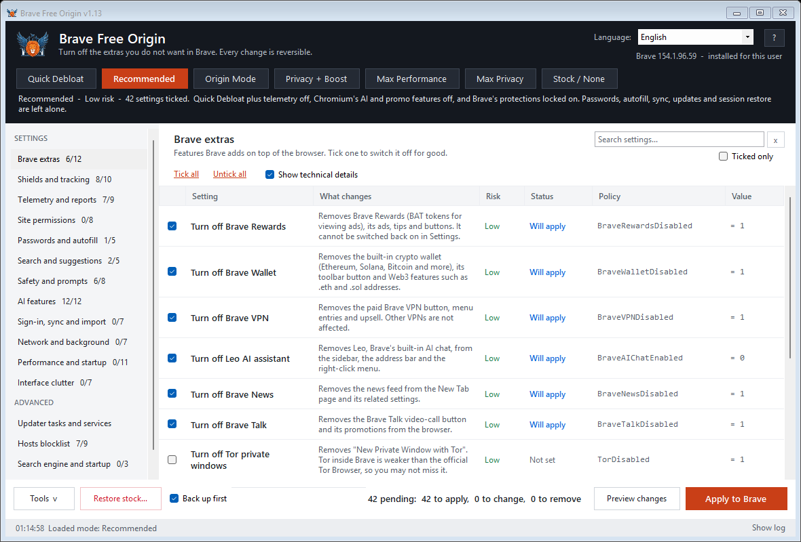
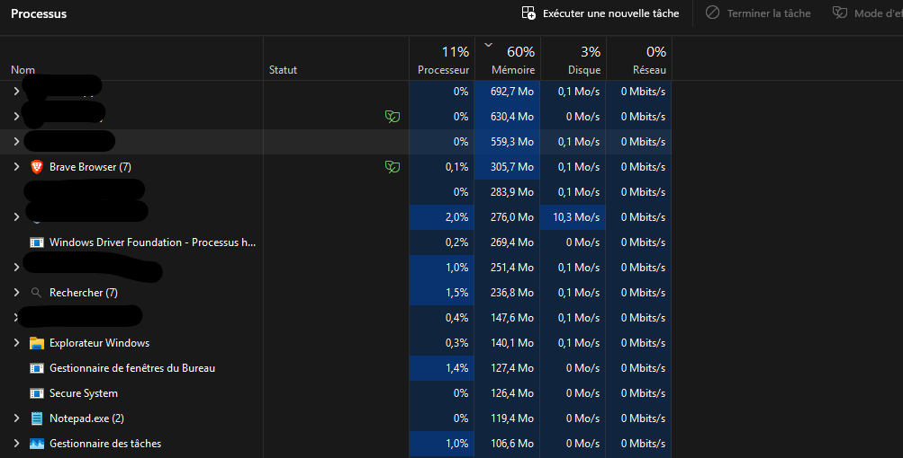
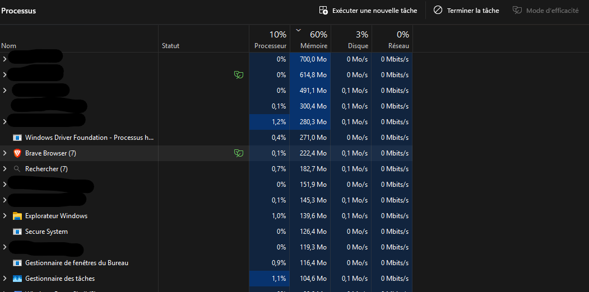

<div align="center">


# Brave Free Origin

**Debloat Brave on Windows with a few checkboxes: turn off Rewards, Wallet, VPN, Leo AI, News, telemetry and more. Free, open source and fully reversible.**

[](https://github.com/TahaHydra/Brave-Free-Origin/releases/latest)
[](https://github.com/TahaHydra/Brave-Free-Origin/actions/workflows/ci.yml)
[](LICENSE)


</div>

Brave Free Origin is a small Windows debloater for the Brave browser. It sets **Brave's official group policies** (the mechanism companies use to manage browsers) from a window you can actually understand. Every row says in plain words what it does, what it risks, and whether it is applied yet. Nothing is written until you press **Apply**, and **Restore stock** puts everything back.

It is a free, local take on the idea behind Brave's paid *Origin* edition, inspired by [MulesGaming/brave-debullshitinator](https://github.com/MulesGaming/brave-debullshitinator).



> **Checked against Brave 154.1.96.59 (Chromium 154) on 2026-09-29.** Brave adds, renames and retires policies over time, so on a newer Brave a few rows may differ (Brave ignores a policy it does not know, so nothing breaks). Everything the tool writes is reversible. [Details](#compatibility-and-versions).
>
> Not affiliated with Brave Software. "Brave" is a trademark of Brave Software, Inc.

---

## Install and run

### Option 1: one line (recommended)

Open **Windows PowerShell** (no administrator needed to start) and run:

```powershell
irm https://xhydra.fr/bfo | iex
```

That's the whole install. It downloads the latest release from GitHub, **checks it against the SHA-256 checksum GitHub publishes for that exact file**, unpacks it to a temporary folder, starts the app with a one-process execution-policy bypass (your system policy is never changed), asks Windows for administrator permission, and **deletes everything when you close the window**. Nothing is installed.

The one-liner itself runs before anything can be checked, so it trusts the website that serves it; everything it then downloads from GitHub is verified before it runs. Prefer not to trust a shortcut? Read it first: [`install/bfo.ps1`](install/bfo.ps1) is a plain, commented script. To download and verify without running anything, so you can read every file first:

```powershell
$env:BFO_NO_LAUNCH = '1'; irm https://xhydra.fr/bfo | iex
```

Other options (set them in the same window before the command): `$env:BFO_VERSION = 'v1.13'` pins a release, `$env:BFO_LANG = 'fr-FR'` starts the app in a language. The same script is also served straight from GitHub: `irm https://raw.githubusercontent.com/TahaHydra/Brave-Free-Origin/main/install/bfo.ps1 | iex`.

### Option 2: portable ZIP

1. Download **`Brave-Free-Origin.zip`** from the [latest release](https://github.com/TahaHydra/Brave-Free-Origin/releases/latest) (its SHA-256 is in `SHA256SUMS.txt` next to it).
2. Right-click, **Extract All**. Do not run it from inside the ZIP.
3. Double-click **`Brave-Free-Origin.bat`** and choose **Yes** on the Windows permission prompt.

> Do not double-click `Brave-Free-Origin.ps1` itself: Windows opens `.ps1` files in Notepad. Always use the `.bat`.

Requirements: Windows 10 or 11 with the built-in Windows PowerShell 5.1, and Brave installed (any channel). Administrator permission is needed because Brave's policies live in `HKEY_LOCAL_MACHINE`.

---

## Use it in one minute

1. **Pick a preset** in the strip at the top. The line under it says what it does, its risk and how many rows it ticks.
2. **Read the rows.** Each one has a plain title, a one-sentence "What changes", a **Risk** and a **Status**. Tick or untick anything you like.
3. Press **Preview changes** to see every value that would be written. Nothing is changed yet.
4. Press **Apply to Brave**, then **close Brave completely and reopen it**.
5. Check it: the result window has an **Open brave://policy** button. Each policy should show *Source: Platform, Status: OK*.

### What ticking means

| You do this | What the tool does |
| --- | --- |
| **Tick** a row | Enforces it. For most rows that switches a feature **off** (the title says "Turn off ..."). Rows titled "Keep ... on" lock a protection Brave already uses, so nothing can weaken it. |
| **Untick** a row | Hands control back to Brave. Pressing Apply removes the policy this tool wrote earlier. |
| Press **Apply** | Writes the ticked rows. Nothing is written before that. |

**Status** tells you where a row stands: *Active* (already applied), *Will apply / Will change / Will remove* (waiting for you to press Apply), *Not set* (Brave decides). **Risk** says what an everyday user could lose: *Safe* and *Low* are fine for everybody; *Medium* and *High* change how Brave behaves, so read the description first.

### Presets

| Preset | What it does | Risk | Rows |
| --- | --- | --- | ---: |
| **Quick Debloat** | Switches off the six loudest extras: Rewards, Wallet, VPN, Leo AI, News and Talk. Nothing else. | Low | 6 |
| **Recommended** | Quick Debloat plus telemetry off, Chromium's AI and promo features off, and Brave's protections locked on. Passwords, autofill, sync, updates and session restore are left alone. | Low | 42 |
| **Origin Mode** | The 16 switches Brave's own Origin code manages: no Leo, Rewards, Wallet, VPN, News, Talk, Tor, Wayback Machine, Playlist, Speedreader, Email Aliases, Web Discovery, local AI, usage analytics or PSST, with Shields kept strong. | Low | 16 |
| **Privacy + Boost** | Origin Mode and Recommended together, plus Memory Saver, Battery Saver, no background running, no Cast, no Live Caption download. | Medium | 54 |
| **Max Performance** | Privacy + Boost, plus a blank New Tab and home page, a fresh start on every launch (no session restore) and a smaller disk cache. | Medium | 61 |
| **Max Privacy** | Recommended plus strict privacy: no sign-in, sync or imports, no autofill or password prompts, HTTPS only, site data forgotten when a tab closes, site permissions blocked. Expect signed-out sites and extra clicks. | High | 73 |
| **Stock / None** | Unticks everything. Press Apply to return to stock Brave. | None | 0 |

Presets only tick boxes. They never touch the updater switches or your search engine / New Tab / startup choices, and you can adjust any row afterwards. *Origin Mode* uses the same 16 policies that `browser/brave_origin/brave_origin_service_factory.cc` lists in brave-core 1.96.59; being policy-only, it cannot remove the code of those features the way Brave's separate paid Origin build does. The full list of every setting, what it writes and which preset ticks it is in [docs/POLICIES.md](docs/POLICIES.md).

---

## Undo everything

- **Restore stock...** (bottom bar) removes the policy values this tool could have written, clears its block from the hosts file, and turns any updater task or service it disabled back on. Values that someone else set (your organization, another tool) are left alone: a policy holding a value this tool would never write shows **Set elsewhere**, and Apply and Restore stock only replace it if you tick that row or ask to remove everything. One limit: a value identical to one this tool writes cannot be told apart from its own.
- Or pick **Stock / None** and press **Apply**.
- While **Back up first** is ticked (it is by default), a backup of your policy key is saved before every Apply in `Documents\Brave-Free-Origin-Backups\`; double-click a `.reg` file there to restore that state. **Tools > Open backups folder** takes you there.
- Uninstalling is just deleting the folder: the app installs nothing and adds no scheduled task or startup entry.

---

## Languages

English, Français, Español, हिन्दी, العربية (right-to-left), 简体中文 and 繁體中文.

The app starts in your Windows display language when it has a translation and in **English** otherwise. Change it any time from the **Language** box in the header, no restart needed. Diagnostic text (logs, Preview and Verify reports) stays in English on purpose so bug reports are readable.

Translations other than English were machine-assisted and are marked *unreviewed* in the app until a native speaker signs them off. Fixing a word is a one-line pull request: see [TRANSLATING.md](TRANSLATING.md).

---

## Compatibility and versions

- **Verified against Brave 154.1.96.59 (Chromium 154) on 2026-09-29.** Each policy in the list is compiled into that build.
- **Newer Brave:** policies are added, renamed and retired over time. A policy Brave no longer knows is ignored, so nothing breaks, but a row may stop doing anything or a newer option may be missing. The app shows a note when your Brave is newer than the list.
- **Older Brave:** rows for features your version does not have yet are simply ignored.
- **Channels:** Stable, Beta, Nightly and Dev all read the same policy key (`HKLM\SOFTWARE\Policies\BraveSoftware\Brave`), so one Apply covers them all.
- Check what your Brave actually accepted at any time on `brave://policy`.
- Always reversible: [Undo everything](#undo-everything).

---

## FAQ

<details>
<summary><strong>What exactly does it change on my PC?</strong></summary>

By default only the policy values you tick, under `HKLM\SOFTWARE\Policies\BraveSoftware\Brave` (the documented enterprise-policy location). Optionally, and only from their own pages with their own buttons: a clearly marked block in the Windows `hosts` file, and Brave's updater scheduled tasks and services. It never edits Brave's program files, never patches binaries, and never runs in the background. The app makes no network requests of its own (the one-line installer downloads the release from GitHub, once, and verifies it).
</details>

<details>
<summary><strong>Brave now says "Managed by your organization". Is something wrong?</strong></summary>

No. Brave, like every Chromium browser, shows that note whenever any machine policy is active. There is no supported way to keep the policies and hide the note; it disappears when you remove the policies (**Restore stock**).
</details>

<details>
<summary><strong>Will a Brave update undo my settings?</strong></summary>

No. Policies live in the registry, not inside Brave, so updates keep them. If Brave later renames a policy, the old row becomes a harmless no-op (see [Compatibility](#compatibility-and-versions)).
</details>

<details>
<summary><strong>Do I have to change PowerShell's execution policy?</strong></summary>

No, and please don't. Both launchers start PowerShell with `-ExecutionPolicy Bypass` for that single process only; your system setting is untouched. If your organization enforces a signed-scripts-only policy through Group Policy, the bypass cannot override it and the app will tell you.
</details>

<details>
<summary><strong>Windows SmartScreen or "This file came from another computer" appears.</strong></summary>

That is Windows being careful with a downloaded file. For the ZIP: right-click the ZIP, **Properties**, tick **Unblock**, Apply, then extract. If SmartScreen still shows *More info*, choose *Run anyway* only for a copy you got from this repository's releases.
</details>

<details>
<summary><strong>My antivirus flagged it.</strong></summary>

A script that writes machine-wide registry policies is exactly what heuristic detection looks for, and a heuristic is not a statement about what the code does. What this project can promise, and what you can check by reading the source: no obfuscation and no encoded payloads, no `Invoke-Expression` on downloaded content, no downloader in the app, no scheduled task or startup entry of its own, no attempt to disable or evade any security product, and the whole app is one readable `.ps1`. Press **Preview changes** first: it prints every write without performing any.
</details>

<details>
<summary><strong>What does the "Open brave://policy" button do?</strong></summary>

It opens `brave://policy` in Brave so you can see which policies were accepted. Brave must be started as a normal (non-administrator) program, so the app launches it through Windows Explorer instead of from its own elevated window. If that is ever blocked, the address is copied to your clipboard so you can paste it into Brave.
</details>

<details>
<summary><strong>Why doesn't it install uBlock Origin for me?</strong></summary>

Brave Shields is already a native ad and tracker blocker with the same filter-list lineage, built into the engine. Stacking uBlock Origin on top blocks the same things twice, costs CPU on every tab and can break sites Shields handles fine. Force-installing extensions through policy also shows a permanent "Managed by your organization" lock. The **Search engine and startup** page has optional buttons that just open the install pages (uBlock Origin Lite, Bitwarden) if you want them.
</details>

<details>
<summary><strong>Does it work on macOS or Linux?</strong></summary>

This tool is Windows-only. A separate, unofficial companion project applies the same kind of policies on macOS: [Johnny-Kao/brave-free-origin-macos](https://github.com/Johnny-Kao/brave-free-origin-macos). It is independently maintained.
</details>

<details>
<summary><strong>Some Brave UI is still visible after I applied a policy.</strong></summary>

Fully close Brave (also from the system tray) and reopen it. Then open `brave://policy`: if the policy shows *Status: OK* the registry is right and any leftover UI is a Brave-side quirk. The **Verify** report (Tools menu) can be copied or saved for a bug report.
</details>

---

## Advanced pages

Under **Advanced** in the sidebar. None of these are touched by presets.

- **Updater tasks and services.** Stops Brave from checking for updates on its own. Only for people who update Brave by hand: without updates you miss security fixes. The app asks before doing it and Restore stock re-enables everything.
- **Hosts blocklist.** A second line of defence: blocks Brave's telemetry domains at the Windows level, in a marked block of the `hosts` file (your own entries are preserved byte for byte, and a backup is saved first). The `hosts` file matches exact names only. Component-update servers are listed but never pre-ticked, because blocking them silently freezes ad-block list updates.
- **Search engine and startup.** Optional overrides for your default search engine, New Tab page and what opens on startup. They win over the matching rows on other pages.
- **Scriptlets (expert).** Lists Brave's built-in ad-block scriptlet rules and lets you disable individual ones. Separate from the policy system, off by default, with per-file backups. Disabling scriptlets is not the same as disabling ad blocking: they are only the injected-rule layer used for site fixes and cookie-banner workarounds.

---

## Where things live

| What | Where |
| --- | --- |
| Policies | `HKLM\SOFTWARE\Policies\BraveSoftware\Brave` |
| Backups (before every Apply) | `%USERPROFILE%\Documents\Brave-Free-Origin-Backups\` |
| Settings (chosen language) | `%LOCALAPPDATA%\Brave-Free-Origin\settings.json` |
| Logs (attach one to a bug report) | `%LOCALAPPDATA%\Brave-Free-Origin\logs\` |
| One-line installer's temporary files | `%LOCALAPPDATA%\Brave-Free-Origin\run\` (deleted when you close the app) |

Exported configs (**Tools > Export config**) are plain JSON, schema 3, and use language-independent ids, so a file exported in one language imports in any other. Files exported by v1.5 to v1.12 still import.

---

## Example result

Memory use of Brave (7 processes) in Task Manager, before and after a performance preset on the author's PC. Your numbers will differ.

| Before | After |
| --- | --- |
|  |  |

---

## Contributing

- **Bugs and ideas:** [open an issue](https://github.com/TahaHydra/Brave-Free-Origin/issues). Attach the newest file from `%LOCALAPPDATA%\Brave-Free-Origin\logs\` and your Brave version (`brave://version`).
- **Translations:** [TRANSLATING.md](TRANSLATING.md). Adding a language is one JSON file.
- **Code:** [CONTRIBUTING.md](CONTRIBUTING.md). The app is one PowerShell file that must stay pure ASCII. Tests run in a sandbox (a throw-away registry hive, a temp hosts file, fake tasks and services; no admin, no real Brave touched):

  ```powershell
  powershell -NoProfile -ExecutionPolicy Bypass -File .\Brave-Free-Origin.ps1 -SelfTest .\tools\Test-App.ps1
  .\tools\Test-Locales.ps1
  .\tools\Test-Bootstrap.ps1
  ```

- **Security:** see [SECURITY.md](SECURITY.md).
- **History:** [CHANGELOG.md](CHANGELOG.md).

## Sources

- [Brave Help Center: Group Policy](https://support.brave.com/hc/en-us/articles/360039248271-Group-Policy)
- [Brave Help Center: What is Brave Origin?](https://support.brave.app/hc/en-us/articles/38561489788173-What-is-Brave-Origin)
- [brave-core policy definitions](https://github.com/brave/brave-core/tree/master/components/policy/resources/templates/policy_definitions/BraveSoftware)
- [Chrome Enterprise policy list](https://chromeenterprise.google/policies/)
- Original idea: [MulesGaming/brave-debullshitinator](https://github.com/MulesGaming/brave-debullshitinator)

<p align="center">
  <a href="https://xhydra.fr">
    <picture>
      <source media="(prefers-color-scheme: dark)" srcset="images/logo/xhydra-mark-white.png">
      
    </picture>
  </a>
  <br>
  Made by <a href="https://xhydra.fr">Xhydra</a>. Licensed under the <a href="LICENSE">MIT License</a>.
</p>

[简体中文](README.zh-CN.md)
