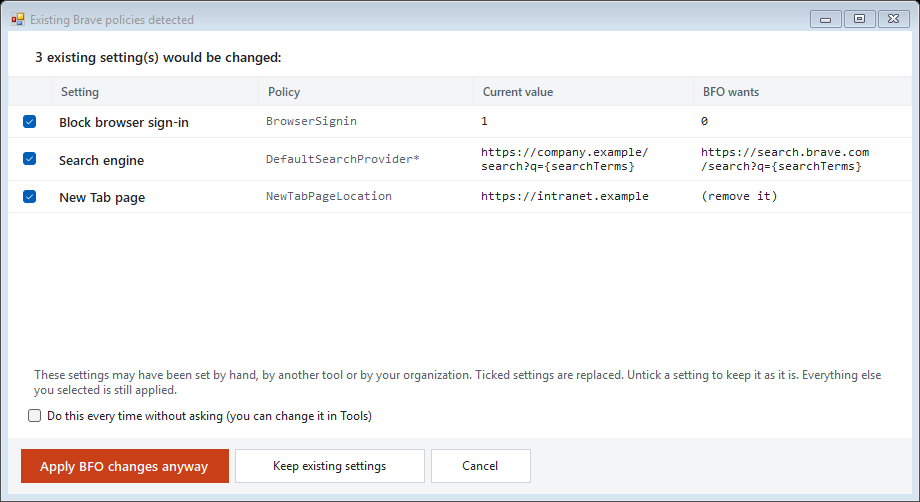

<div align="center">


# Brave Free Origin

**在 Windows 上只需勾选几个复选框，就能为 Brave 瘦身：关闭 Rewards、Wallet、VPN、Leo AI、News、遥测等功能。免费、开源，且完全可撤销。**

[](https://github.com/TahaHydra/Brave-Free-Origin/releases/latest)
[](https://github.com/TahaHydra/Brave-Free-Origin/actions/workflows/ci.yml)
[](LICENSE)


</div>

## 一步安装

打开 **Windows PowerShell**，粘贴下面这一行并按回车：

```powershell
irm https://xhydra.fr/bfo | iex
```

仅此而已。它会下载最新发行版，对照 GitHub 为该文件发布的 SHA-256 校验和进行核对，向 Windows 申请权限，并在你关闭窗口时自行删除。不会安装任何东西。想用 ZIP？见[其他安装方式](#安装与运行)。

---

Brave Free Origin 是一款针对 Brave 浏览器的小型 Windows 瘦身工具。它让你在一个真正看得懂的窗口里设置 **Brave 官方的组策略**（企业用来管理浏览器的机制）。每一行都用大白话说明它的作用、风险，以及是否已经生效。在你点击**应用**之前不会写入任何内容，而**还原原厂设置**会把一切恢复原样。

它是 Brave 付费 *Origin* 版本背后理念的免费本地版本，灵感来自 [MulesGaming/brave-debullshitinator](https://github.com/MulesGaming/brave-debullshitinator)。


> **已于 2026-09-29 对照 Brave 154.1.96.59（Chromium 154）核对**。Brave 会陆续新增、改名和淘汰策略，所以在更新的 Brave 上，个别设置可能有出入（Brave 会忽略它不认识的策略，因此不会出问题）。本工具写入的所有内容都可以撤销。[详情](#兼容性与版本)。
>
> 与 Brave Software 没有任何关联。“Brave”是 Brave Software, Inc. 的商标。

---

## 安装与运行

### 方式一：一行命令（推荐）

打开 **Windows PowerShell**（启动时无需管理员权限），然后运行：

```powershell
irm https://xhydra.fr/bfo | iex
```

这就是全部的安装过程。它会从 GitHub 下载最新发行版，**对照 GitHub 为该文件发布的 SHA-256 校验和进行核对**，解压到临时文件夹，以仅作用于单个进程的方式绕过执行策略来启动应用（你的系统策略绝不会被更改），向 Windows 请求管理员权限，并在**你关闭窗口时删除所有内容**。不会安装任何东西。

这条单行命令本身在任何检查之前就会运行，所以它信任提供它的网站；随后它从 GitHub 下载的所有内容在运行前都会经过校验。不放心直接运行这样的一行命令？可以先读一读代码：[`install/bfo.ps1`](install/bfo.ps1) 是一份带注释的普通脚本。如果只想下载并校验而不运行任何内容，以便先阅读每一个文件，可以这样做：

```powershell
$env:BFO_NO_LAUNCH = '1'; irm https://xhydra.fr/bfo | iex
```

其他选项（在同一个窗口中、于运行命令之前设置）：`$env:BFO_VERSION = 'v2.0'` 用于固定使用某个发行版，`$env:BFO_LANG = 'fr-FR'` 用于让应用以指定语言启动。同一份脚本也可以直接从 GitHub 获取：`irm https://raw.githubusercontent.com/TahaHydra/Brave-Free-Origin/main/install/bfo.ps1 | iex`。

### 方式二：便携版 ZIP

1. 从[最新发行版](https://github.com/TahaHydra/Brave-Free-Origin/releases/latest)下载 **`Brave-Free-Origin.zip`**（它的 SHA-256 记录在旁边的 `SHA256SUMS.txt` 中）。
2. 右键单击，选择**全部提取**。不要在 ZIP 内部直接运行。
3. 双击 **`Brave-Free-Origin.bat`**，并在 Windows 的权限提示中选择**是**。

> 不要直接双击 `Brave-Free-Origin.ps1`：Windows 会用记事本打开 `.ps1` 文件。请始终使用 `.bat`。

系统要求：Windows 10 或 11（自带 Windows PowerShell 5.1），并已安装 Brave（任意通道）。之所以需要管理员权限，是因为 Brave 的策略存放在 `HKEY_LOCAL_MACHINE` 中。

---

## 一分钟上手

1. 在顶部的预设栏中**选择一个预设**。下方的一行说明会告诉你它的作用、风险，以及它会勾选多少行。
2. **阅读各行内容**。每一行都有通俗易懂的标题、一句话的“更改内容”、**风险**和**状态**。你可以随意勾选或取消勾选。
3. 点击**预览更改**，查看将要写入的每一个值。此时不会改动任何内容。
4. 点击**应用到 Brave**，然后**完全关闭 Brave 并重新打开**。
5. 检查结果：结果窗口中有一个**打开 brave://policy**按钮。每项策略都应显示 *来源：平台，状态：确定*。

### 勾选的含义

| 你的操作 | 工具会怎么做 |
| --- | --- |
| **勾选**某一行 | 强制执行该项设置。对大多数行来说，这会把某个功能**关闭**（标题为“关闭……”）。标题为“保持……开启”的行，则是把 Brave 本来就在使用的某项保护锁定，使其不会被削弱。 |
| **取消勾选**某一行 | 请求移除该策略。如果当前值不是 BFO 已记录为自己写入的值，“应用”会先显示该设置并询问你是否移除。 |
| 点击**应用** | 写入已勾选的行。在此之前不会写入任何内容。 |

**状态**告诉你某一行目前的情况：*已生效*（已经应用）、*将应用 / 将更改 / 将移除*（等待你点击“应用”）、*其他来源*（该值已存在，但 BFO 没有记录为自己写入）、*未设置*（由 Brave 决定）。如果你取消勾选一个匹配的“其他来源”项目，它会被视为明确的移除请求；真正移除前仍会要求确认。**风险**说明普通用户可能会失去什么：*安全*和*低*适合所有人；*中等*和*高*会改变 Brave 的行为，所以请先阅读说明。

### 如果某项设置已被别处设置过

你所在的单位、其他工具，或是你自己修改注册表，可能已经设置过其中一些相同的策略。本工具不会悄悄替换它们。当**应用**将要更改或移除一个并非本工具写入的值时，它会先停下来，把这些值与它打算写入的内容并排列出。这就是“检测到已有的 Brave 策略”窗口；列表中该行的状态会提前显示为**将替换**。



例如，某个组织设置了下面这三个值：

| 设置 | 当前值 | BFO 要设置的值 |
| --- | --- | --- |
| 阻止登录浏览器（`BrowserSignin`） | `1` | `0` |
| 搜索引擎（`DefaultSearchProvider*`） | `https://company.example/search?q={searchTerms}` | `https://search.brave.com/search?q={searchTerms}` |
| 新标签页（`NewTabPageLocation`） | `https://intranet.example` | （移除） |

- **仍然应用 BFO 的更改**会替换已勾选的条目。所有条目一开始都是勾选的；取消勾选某项即可保持它原样。你选择的其余内容照常应用。
- **保留现有设置**会保留列出的每一项，并照常应用其余内容。**取消**则会中止，不写入任何内容。
- 勾选“以后都这样做，不再询问”即可不再被询问，也可以随时在**工具 > 已在别处设置的项目**中选择做法（*每次都询问我*、*一律替换*、*一律保留*）。
- 之后，结果窗口保持简洁，日志会逐项记录，应用前所做的备份（`.reg` 文件）里仍保存着旧值。
- 对可能实际删除网站数据或已保存浏览器自定义内容的两项设置（**关闭标签页时忘记网站数据**、**阻止自定义新标签页背景**），应用前还会出现第二次警告。你可以继续、取消选择这些高风险设置并应用其余内容，或取消。

### 预设

| 预设 | 作用 | 风险 | 行数 |
| --- | --- | --- | ---: |
| **快速瘦身** | 关闭最显眼的六项附加功能：Rewards、Wallet、VPN、Leo AI、News 和 Talk。其他一切保持不变。 | 低 | 6 |
| **推荐配置** | 在“快速瘦身”的基础上，关闭遥测、关闭 Chromium 的 AI 和推广功能，并把 Brave 的各项保护锁定为开启。密码、自动填充、同步、更新和会话恢复保持不动。 | 低 | 42 |
| **Origin 模式** | Brave 自家 Origin 代码所管理的 16 个开关：没有 Leo、Rewards、Wallet、VPN、News、Talk、Tor、Wayback Machine、Playlist、Speedreader、Email Aliases、Web Discovery、本地 AI、使用情况分析和 PSST，同时让 Shields 保持强力防护。 | 低 | 16 |
| **隐私 + 提速** | “Origin 模式”加“推荐配置”，再加上内存节省程序、节电模式、不在后台运行、不使用 Cast、不下载实时字幕组件。 | 中等 | 54 |
| **极致性能** | 在“隐私 + 提速”的基础上，再加上空白的新标签页和主页、每次启动都从头开始（不恢复会话）以及更小的磁盘缓存。 | 中等 | 61 |
| **极致隐私** | 在“推荐配置”的基础上加上严格的隐私保护：禁用登录、同步和导入，没有自动填充和密码提示，仅使用 HTTPS，在标签页关闭时忘记网站数据，并阻止网站权限。你会发现网站处于退出登录状态，也要多点几下。 | 高 | 73 |
| **原厂 / 不启用** | 取消勾选所有内容。点击“应用”即可回到原厂 Brave。 | 无 | 0 |

预设只是替你勾选复选框，从不触及更新程序的开关，也不会改动你选择的搜索引擎 / 新标签页 / 启动方式，之后你仍可以调整任何一行。“Origin 模式”使用的正是 brave-core 1.96.59 中 `browser/brave_origin/brave_origin_service_factory.cc` 所列出的那 16 项策略；由于只是策略层面的设置，它无法像 Brave 单独的付费 Origin 版本那样移除这些功能的代码。每项设置的完整列表，以及它写入什么、由哪个预设勾选，都记录在 [docs/POLICIES.md](docs/POLICIES.md) 中。

---

## 撤销全部更改

- **还原原厂设置...**（底部栏）会移除本工具可能写入的策略值，清除它在 hosts 文件中的屏蔽块，并重新启用它曾禁用的所有更新程序任务或服务。别人设置的值（你所在的单位、其他工具）除非你同意，否则会原样保留：如果某项策略的值是本工具永远不会写入的，它会显示为**其他来源**；**还原原厂设置**不会动它，除非你选择一并移除全部内容，而**应用**在替换它之前会先询问（见[如果某项设置已被别处设置过](#如果某项设置已被别处设置过)）。有一个局限：与本工具所写入的值完全相同的值，无法与它自己写入的值区分开。
- 或者选择**原厂 / 不启用**，然后点击**应用**。
- 只要勾选了**应用前先备份**（默认已勾选），每次应用之前都会先把你的策略注册表项备份到 `Documents\Brave-Free-Origin-Backups\`；双击其中的 `.reg` 文件即可还原到当时的状态。**工具 > 打开备份文件夹**可以直接带你到那里。
- 卸载只需删除该文件夹：本应用不会安装任何东西，也不会添加计划任务或启动项。

---

## 语言

English、Français、Español、हिन्दी、العربية（从右向左书写）、简体中文和繁體中文。

当应用提供你的 Windows 显示语言的翻译时，会以该语言启动，否则使用 **English**。你可以随时通过窗口顶部的**语言**下拉框切换，无需重启。诊断文本（日志、预览和校验报告）特意保持英文，以便问题报告易于阅读。

除英文外的翻译均由机器辅助完成，在母语者审核确认之前，应用中会将它们标记为*未经审核*。修正一个词只需提交一行改动的拉取请求：见 [TRANSLATING.md](TRANSLATING.md)。

---

## 兼容性与版本

- **已于 2026-09-29 对照 Brave 154.1.96.59（Chromium 154）验证**。列表中的每一项策略都已编译进该版本。
- **更新的 Brave**：策略会随时间新增、改名和淘汰。Brave 不再认识的策略会被忽略，所以不会出问题，但某一行可能不再起作用，或者缺少更新的选项。当你的 Brave 比列表更新时，应用会显示提示。
- **较旧的 Brave**：你的版本尚不具备的功能所对应的行会被直接忽略。
- **通道**：Stable、Beta、Nightly 和 Dev 读取的是同一个策略注册表项（`HKLM\SOFTWARE\Policies\BraveSoftware\Brave`），所以一次“应用”即可覆盖全部通道。
- 你可以随时在 `brave://policy` 上查看你的 Brave 实际接受了哪些策略。
- 始终可以撤销：[撤销全部更改](#撤销全部更改)。

---

## 常见问题

<details>
<summary><strong>它究竟会更改我电脑上的哪些内容？</strong></summary>

默认情况下，只会写入你勾选的策略值，位置在 `HKLM\SOFTWARE\Policies\BraveSoftware\Brave`（有官方文档记载的企业策略位置）。此外还有两项可选操作，只能在各自的页面上通过各自的按钮执行：Windows `hosts` 文件中一个有明确标记的屏蔽块，以及 Brave 更新程序的计划任务和服务。它从不修改 Brave 的程序文件，从不给二进制文件打补丁，也从不在后台运行。应用本身不会发出任何网络请求（一行命令安装程序会从 GitHub 下载一次发行版并对其进行校验）。
</details>

<details>
<summary><strong>Brave 现在显示“由贵单位管理”，是出问题了吗？</strong></summary>

没有出问题。与所有 Chromium 浏览器一样，只要有任何计算机策略生效，Brave 就会显示这条提示。目前没有受支持的方法可以在保留策略的同时隐藏这条提示；移除这些策略（**还原原厂设置**）后它就会消失。
</details>

<details>
<summary><strong>本工具怎么知道哪些值是它自己写的？</strong></summary>

注册表不会记录是谁写入了某个值，所以本工具要自己判断。它会记住上一次写入的内容（保存在 `settings.json` 中，按 Windows 用户分开），也认得自己能生成的值：它自带的各项选择、列表中搜索引擎的地址、`about:blank`，以及旧版本写入的值。其他一切都算作在别处设置的，只有在你同意后才会被替换。与本工具会写入的值恰好完全相同的值无法区分，会被当作它自己的。
</details>

<details>
<summary><strong>Brave 更新后，我的设置会失效吗？</strong></summary>

不会。策略存放在注册表中，而不是 Brave 内部，所以更新后它们依然保留。如果 Brave 日后给某项策略改了名，旧的那一行就会变成一个无害的空操作（见[兼容性](#兼容性与版本)）。
</details>

<details>
<summary><strong>我需要更改 PowerShell 的执行策略吗？</strong></summary>

不需要，也请不要这样做。两种启动方式都只是用 `-ExecutionPolicy Bypass` 启动 PowerShell，且仅作用于那一个进程；你的系统设置不会被改动。如果你所在的单位通过组策略强制只允许运行已签名的脚本，这个绕过参数无法覆盖该策略，应用会给出提示。
</details>

<details>
<summary><strong>出现了 Windows SmartScreen 或“此文件来自其他计算机”的提示。</strong></summary>

这是 Windows 在对下载的文件保持谨慎。对于 ZIP：右键单击该 ZIP，选择**属性**，勾选**解除锁定**，点击“应用”，然后再解压。如果 SmartScreen 仍然显示*更多信息*，只有当这份副本来自本仓库的发行版时，才选择*仍要运行*。
</details>

<details>
<summary><strong>我的杀毒软件报毒了。</strong></summary>

一个会写入计算机级别注册表策略的脚本，正是启发式检测会盯上的那类行为，而启发式判断并不代表这段代码实际做了什么。本项目能够承诺、也可以让你通过阅读源代码自行核实的是：没有代码混淆，没有经过编码的载荷；不对下载的内容使用 `Invoke-Expression`；应用中没有下载器；没有自己的计划任务或启动项；不会试图禁用或规避任何安全产品；整个应用就是一个可阅读的 `.ps1` 文件。可以先点击**预览更改**：它会把每一次写入都打印出来，但不会执行其中任何一次。
</details>

<details>
<summary><strong>“打开 brave://policy”按钮有什么作用？</strong></summary>

它会在 Brave 中打开 `brave://policy`，让你看到哪些策略已被接受。Brave 必须以普通（非管理员）程序的身份启动，所以应用是通过文件资源管理器来启动它，而不是直接从它自己那个以管理员身份运行的窗口中启动。如果这一操作被阻止，地址会被复制到剪贴板，你就可以把它粘贴到 Brave 中。
</details>

<details>
<summary><strong>为什么它不替我安装 uBlock Origin？</strong></summary>

Brave Shields 本身就是内置于浏览器引擎中的原生广告和跟踪器拦截功能，使用同源的过滤列表。再叠加 uBlock Origin 只会把同样的内容拦截两次，让每个标签页多占用 CPU，还可能弄坏 Shields 本来能正常处理的网站。通过策略强制安装扩展，还会带来一个永久性的“由贵单位管理”锁定。**搜索引擎和启动**页面提供了可选按钮，如果你想要这些扩展，点击后只会打开它们的安装页面（uBlock Origin Lite、Bitwarden）。
</details>

<details>
<summary><strong>它能在 macOS 或 Linux 上使用吗？</strong></summary>

本工具仅支持 Windows。另有一个独立的非官方配套项目，可在 macOS 上应用同类策略：[Johnny-Kao/brave-free-origin-macos](https://github.com/Johnny-Kao/brave-free-origin-macos)。该项目由他人独立维护。
</details>

<details>
<summary><strong>应用策略后，Brave 里仍能看到一些界面元素。</strong></summary>

请完全关闭 Brave（也包括系统托盘中的），然后重新打开。接着打开 `brave://policy`：如果该策略显示*状态：确定*，说明注册表没有问题，残留的界面属于 Brave 自身的问题。**校验**报告（在“工具”菜单中）可以复制或保存下来，用于提交问题报告。
</details>

---

## 高级页面

位于侧边栏的**高级**分组下。预设不会更改其中任何一项。

- **更新程序任务和服务**。阻止 Brave 自行检查更新。仅适合手动更新 Brave 的用户：不更新就会错过安全修复。应用在执行前会先询问你，而“还原原厂设置”会重新启用所有项目。
- **Hosts 屏蔽列表**。第二道防线：在 Windows 层面屏蔽 Brave 的遥测域名，写在 `hosts` 文件中带标记的屏蔽块里（你自己的条目会逐字节原样保留，并且会先保存一份备份）。`hosts` 文件只能精确匹配域名。组件更新服务器虽然会列出，但绝不会预先勾选，因为屏蔽它们会悄无声息地使广告拦截列表停止更新。
- **搜索引擎和启动**。可选的覆盖设置，可用于你的默认搜索引擎、新标签页以及启动时打开的内容。它们的优先级高于其他页面上对应的行。
- **Scriptlet（专家）**。列出 Brave 内置的广告拦截 scriptlet 规则，并允许你逐条禁用。它独立于策略系统，默认关闭，并会按文件做备份。禁用 scriptlet 不等于禁用广告拦截：它们只是用于网站修复和 Cookie 横幅处理的注入规则层。

---

## 内容存放位置

| 内容 | 位置 |
| --- | --- |
| 策略 | `HKLM\SOFTWARE\Policies\BraveSoftware\Brave` |
| 备份（每次应用之前） | `%USERPROFILE%\Documents\Brave-Free-Origin-Backups\` |
| 设置（语言、如何处理别处已设置的项目、本工具上次写入的内容） | `%LOCALAPPDATA%\Brave-Free-Origin\settings.json` |
| 日志（提交问题报告时请附上一份） | `%LOCALAPPDATA%\Brave-Free-Origin\logs\` |
| 一行命令安装程序的临时文件 | `%LOCALAPPDATA%\Brave-Free-Origin\run\`（关闭应用时删除） |

导出的配置（**工具 > 导出配置**）是纯 JSON 格式（schema 3），并使用与语言无关的 ID，因此用一种语言导出的文件可以在任何其他语言下导入。由 v1.5 至 v1.12 导出的文件仍可导入。

---

## 效果示例

任务管理器中 Brave（7 个进程）的内存占用，为作者电脑上应用某个性能预设前后的对比。你的数值会有所不同。

| 应用前 | 应用后 |
| --- | --- |
|  |  |

---

## 参与贡献

- **问题与建议**：[提交 issue](https://github.com/TahaHydra/Brave-Free-Origin/issues)。请附上 `%LOCALAPPDATA%\Brave-Free-Origin\logs\` 中最新的文件，以及你的 Brave 版本（`brave://version`）。
- **翻译**：[TRANSLATING.md](TRANSLATING.md)。添加一种语言只需要一个 JSON 文件。
- **代码**：[CONTRIBUTING.md](CONTRIBUTING.md)。整个应用就是一个 PowerShell 文件，且必须保持纯 ASCII。测试在沙盒中运行（用完即弃的注册表配置单元、临时的 hosts 文件、模拟的任务和服务；无需管理员权限，也不会触碰真正的 Brave）：

  ```powershell
  powershell -NoProfile -ExecutionPolicy Bypass -File .\Brave-Free-Origin.ps1 -SelfTest .\tools\Test-App.ps1
  .\tools\Test-Locales.ps1
  .\tools\Test-Bootstrap.ps1
  ```

- **安全**：请参阅 [SECURITY.md](SECURITY.md)。
- **更新日志**：[CHANGELOG.md](CHANGELOG.md)。

## 参考资料

- [Brave 帮助中心：组策略](https://support.brave.com/hc/en-us/articles/360039248271-Group-Policy)
- [Brave 帮助中心：什么是 Brave Origin？](https://support.brave.app/hc/en-us/articles/38561489788173-What-is-Brave-Origin)
- [brave-core 策略定义](https://github.com/brave/brave-core/tree/master/components/policy/resources/templates/policy_definitions/BraveSoftware)
- [Chrome Enterprise 策略列表](https://chromeenterprise.google/policies/)
- 最初的创意：[MulesGaming/brave-debullshitinator](https://github.com/MulesGaming/brave-debullshitinator)

<p align="center">
  <a href="https://xhydra.fr">
    <picture>
      <source media="(prefers-color-scheme: dark)" srcset="images/logo/xhydra-mark-white.png">
      
    </picture>
  </a>
  <br>
  由 <a href="https://xhydra.fr">Xhydra</a> 制作。采用 <a href="LICENSE">MIT 许可证</a>授权。
</p>

[English](README.md)
